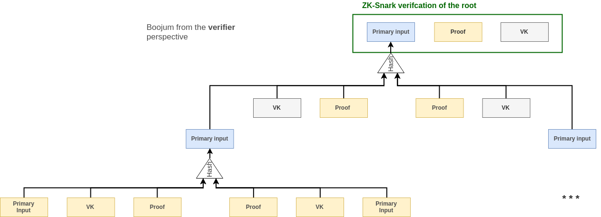

# Go-boojum

Boojum is an WIP protocol that aims at massively reducing the cost of ZK-SNARK verification on a blockchain through a proof aggregation scheme. A PoC demo implementation of ZK-SNARK aggregation is available in this repository.

## Security

**The code in this repository is not suitable for production. It is PoC grade and has not undergone extensive testing. It additionally leaks memory and has some known flaws.**

## Overview

This [article](https://eprint.iacr.org/2014/595.pdf) introduced recursive snark aggregation using cycle of elliptic curve, and created the concept of PCD and it has been seen as potential solution to instantly (30ms) verify the state of the chain through a single SNARK verification. This however raises the problem of data availability as it can potentially create situations where the state becomes inaccessible.

We propose here a predicate-agnostic solution to combine multiple ppzksnarks proofs (forged for various circuits). This is a variation of PCD and it comes with two circuits described in the diagram below:

Both circuits represents the following predicate: "I have run a ZK-SNARK verifier algorithm on 2 given triplets (proofs, vk and primary inputs) and their output was 1 in both". This will work only for any circuits with a primary input of length 1 but this is however not a practical issue : given a snark friendly cryptographic hash function, we can always convert a multi-primary-input circuit into a single-primary-input by passing the primary inputs as auxilliary and adding the following constraint :

    Primary = Hash(Auxilliary)

This heuristic is furthermore applied to our circuits, thanks to that we enable proof for an instance of boojum circuit to be used as an input of another instance. Hence, we can recursively aggregate proof with the same two circuits.

The two circuits differs in the sense that they are not defined on the same EC. Any proof generated on one of theses can be verified recursively inside a proof on the other one. This is a necessary conditions for constructing a practical recursive SNARKs. We are using the elliptic curve cycle MNT4-MNT6 described [here](https://eprint.iacr.org/2014/595.pdf).

One of the main difference with PCD is that Boojum accepts a verification key as a public parameter. The generator does not make assumption over the proof he is going to verify. The concern here is not about what circuit is being proved on but rather to convince that a verifier has run successfully for a given triplet (proof, verification key, primary input).

Additionnally, PCD recursive aggregation works in a sequential way: assignments are added one after the others in the proof while we describe a protocol aggregating proofs in a hierarchical fashion.

The leaf nodes (ie: the batch of proofs to be aggregated together) are inputed as:

* A verification key
* A proof
* The primary inputs of the circuits.

## On-chain verification

Each parent node (ie: aggregated proof) takes the hash of the previous proofs as primary inputs. Therefore during verification of the root proof, we need to first reconstruct its input by recursively hashing the intermediary nodes.

    In yellow, the elements that are sent in the payload to the verifier.
    In grey, the elements that are already known to the verifier
    In blue, the elements that are recomputed during verification by the verifier

### Gas Cost estimation

Although no proper benchmark has been run yet. We can estimate that currently each aggregated proofs weights 355 bytes in average (373B for MNT6 and 337B for MNT4). And each verification key (on MNT4 only) weights 717B. This adds up to (355 + 337 + 717 = 1409B) for each proof. This represents an extra cost of 88641 Gas for each proof assuming we can neglect the zero-bytes.

This estimation also does not takes into account the cost of re-hashing the merkle tree. The current implementation of the hash function available in libsnark. It is worth noting that this hash function has been cryptanalyzed (see this [article](http://www.math.ttu.edu/~cmonico/research/linearhash.pdf))

Other options are being considered as a potential replacement [WIP]:

* Pedersen Hash (We could re-use zcash implementation)
* MiMc
* David-Meyers

In any case the overhead for each aggregated snark is significantly lower compared to the cost of a verification.

### Improving the size of the payload

In this aggregation protocol is that we don't care this much about the intermediary proofs. The only thing that matter is that *theses proofs exist and have been successfully verified* the same applies for the leafs proofs (ie: the proofs that are submitted to the process of aggregation).

In the end what an end-user wants to prove is only that they have a valid assignment for a given public input and a given circuit. Therefore, instead of publishing the proofs on-chain we could simply publish a hash of them. The proof would have to be communicated off-chain to the aggregator pool though.

Those improvement of the circuit are represented below:

## Off-chain aggregation

The tree structure of the aggregated proof makes it possible to distribute the proving computation across a pool of worker. Given that each aggregation steps takes about 20sec, it would takes over 5.5 hours to aggregate 1024 proofs. However, in a perfectly distributed case with 512 workers the process finishes in only 3min12. If we could run a prover on a GPU we would then be able to have a much better throughput without requiring a too big pool.

The protocol should be reasonably efficient (ie: replicate as least as possible the aggregation), resilient to malicious actors (no one can prevent or slow down the aggregation process efficiently).

Additionally this protocol should include a reward mechanism in it in order to incentivize the worker to join the pool. This is not a trivial task because the BFT condition requires tasks to be replicated and that can create situations in which workers are actually not rewarded for their tasks.

### Proof of Stake based aggregation protocol

One of the possible design is to use of a PoS leader election (so we can avoid sybil attack):

* People can submit a proof to the pool in they provide token/eths
* The workers can join the pool if they provide a stake
* A leader is randomly elected in the pool at a regular rate
* The leader dispatch the job across the pool and manage faults
* Each worker adds an address in its aggregation proof so that he gets rewarded
* Each worker keeps track of his previous jobs (in case of leader failure)
* Each job produced by a worker is checked by the verifier.
* Each pair of job assigned to the worker by the leader is checked.
* When all the jobs are complete, the leader sends the aggregated proof to be verified on-chain.
* If the leader does not answer after a specified timeout, the next elected one takes the leadership and each worker sends their past jobs.

The leader should schedule tasks as randomly as possible in order to make it impossible for a rogue worker to get it all the time. In this case, workers and leader failure are well-handled. But we need other mechanism to ensure attack are less likely to happen.

* Each exchanged message should be authenticated (eg: signed). When a fake proof is produced any member can report it and earn the faulty worker's stack.

## Prerequisite

In order to build the source we need the following dependencies

* Docker

## Runing the demo

In this demo, a single worker go-routine aggregates a total of 8 proofs, the aggregation process is controlled by a scheduler go-routine who then verify the aggregated proof.

### With docker

    docker build . -t demo-boojum
    docker run demo-boojum

## Related work

This works makes use of

* [Succinct Non-Interactive Zero Knowledge for a von Neumann Architecture](https://eprint.iacr.org/2013/879.pdf)
* [Incrementally Verifiable Computation or Proofs of Knowledge Imply Time/Space Efficiency](https://link.springer.com/content/pdf/10.1007%2F978-3-540-78524-8_1.pdf)
* [Scalable Zero Knowledge via Cycles of Elliptic Curves](https://eprint.iacr.org/2014/595.pdf)
* [Aggregation protocol for large scale Byzantine committee](https://docs.google.com/presentation/d/1fL0mBF5At4ojW0HhbvBQ2yJHA3_q8q8kiioC6WvY9g4/edit#slide=id.p)