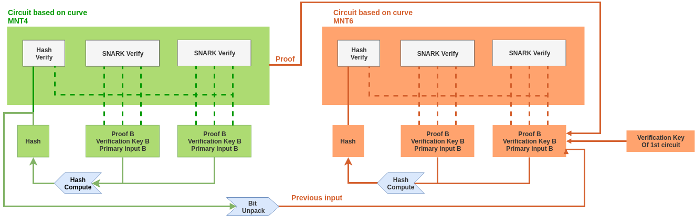
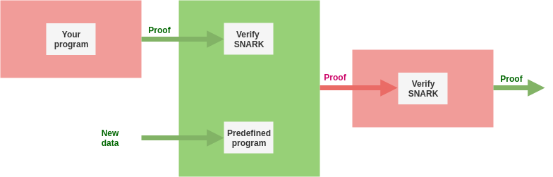
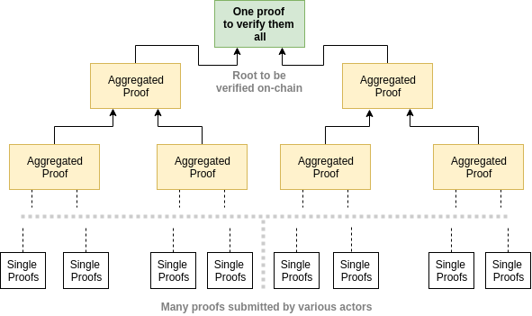
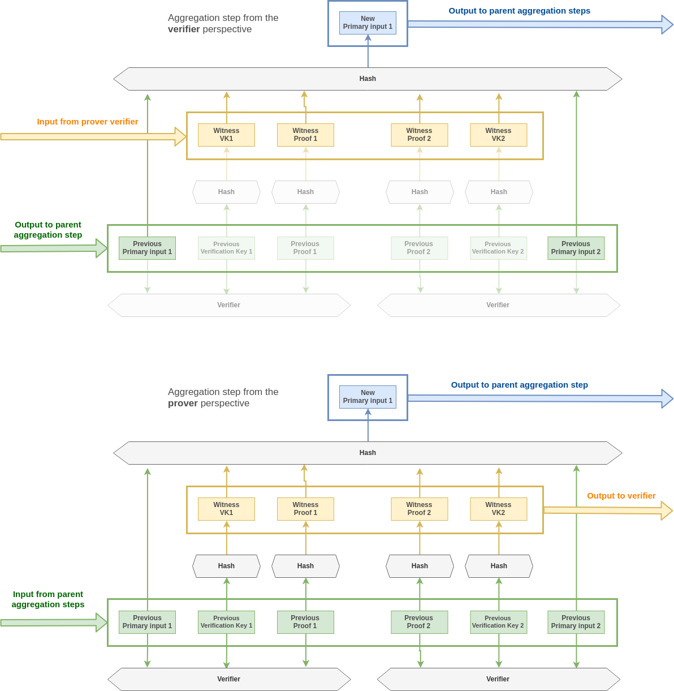

# Go-boojum

Boojum is an WIP protocol that aims at massively reducing the cost of zk verification on a blockchain through ZK-Snark proof aggregation.
A demo implementation of ZK-SNARK aggregation.

## Security

**The code in this repository is not suitable for production. It is PoC grade and has not undergone extensive testing. It additionally leaks memory.**

## Overview

This [article](https://eprint.iacr.org/2014/595.pdf) introduced recursive snark aggregation using cycle of elliptic curve, and created the concept of PCD and it has been seen as potential solution to instantly (30ms) verify the state of the chain through a SNARK verification. This however raised the problem of data availability as it could potentially creates situations where the state becomes inaccessible. Another problem comes from the fact that a single instruction takes up to 10sec in order to be added inside the proof which makes STARKs more adapted for that.

We propose here a circuit-agnostic solution to combine multiple ppzksnarks proofs (forged for various circuits). This is a variation of PCD comes with two circuits described in the diagram below:

Both circuits are in facts almost identicals, they only differs in the sense that they are not defined on the same groups. Any proof generated on one of theses can be verified recursively inside a proof on the other one. This is a necessary conditions for constructing a recursive SNARKs.

This is also similar to Proof Carrying Data system that are described in a simplified fashion below.

The main difference with boojum is the PCD takes assignment only for a predetermined set of programs. This is because the verifier of the circuit wants to know what is being verified and to be sure that the PCD doesn't contains rogue proofs for an unrelated circuits.

Here, we are not interested in what the proof contains but rather in if they are valid. Our goal here is to convert a batch of proof for any* circuits into a single one. Additionally, PCDs works in a sequentials way while we use a hierarchical structure here.

The leaf nodes (ie: the batch of proofs to be aggregated together) are inputed as:

* A verification key
* A proof
* The primary inputs of the circuits.

## On-chain verification

Each parent node (ie: aggregated proof) takes the hash of the previous proofs as primary inputs. Therefore during verification of the root proof, we need to first reconstruct its input by recursively hashing the intermediary nodes.

    Input = H(InputLeft, InputRight, ProofLeft, ProofRight, VKleft, VkRight)

Although no proper benchmark has been run yet. We can estimate that currently each aggregated proofs weights 355 bytes in average (373B for MNT6 and 337B for MNT4). And each verification key (on MNT4 only) weights 717B. This adds up to (355 + 337 + 717 = 1409B) for each proof. This represents an extra cost of 88641 Gas for each proof assuming we can neglect the zero-bytes and the cost.

This estimation does not takes into account the cost of re-hashing the merkle tree. The current implementation makes use of subset-sum hash which is natively implemented in libsnark but which is broken today. Some of the considered options are:

* Pedersen Hash (We could re-use zcash implementation)
* MiMc
* David-Meyers

At this point, all I know for sure is that the cost of hashing will be linear in the size of the payload.

## Improving the size of the payload

In this aggregation protocol is that we don't care this much about the intermediary proofs. The only thing that matter is that *theses proofs exist and have been successfully verified* the same applies for the leafs proofs (ie: the proofs that are submitted to the process of aggregation).

In the end what an end-user wants to prove is only that they have a valid assignment for a given public input and a given circuit. Therefore, instead of publishing the proofs on-chain we could simply publish a hash of them. The proof would have to be communicated off-chain to the aggregator pool though.

We those improvement the circuit can be represented as below:

## Off-chain aggregation

Each aggregation steps takes about 20sec, that means it would takes over 5.5 hours to aggregate 1024 proofs. However, the tree structure makes it easy to possible to distribute across a pool of worker.

The pool would load balance the process of aggregation and each worker would be rewarded for its work. For this purpose we can add an address in the verification in order to protect the worker from impersonation. Adding rewards could however also introduce the issue of byzantine behaviour : a powerfull prover would be incentivized to steal other's job. This part is still a WIP.

We would also need an aggregation protocol that ensure no attacker can effectively prevent or slow down the aggregation process.

The protocol [handle](https://docs.google.com/presentation/d/1fL0mBF5At4ojW0HhbvBQ2yJHA3_q8q8kiioC6WvY9g4/edit#slide=id.p) described here is currently being considered as the aggregation protocol. It is tolerant to byzantine failures and scales wells with large networks. However, the current implementations uses a producer - consumer approach.

## Possible adaptation with Handel

Some modification would have to be done to the protocol though because the problematic has a few small difference with BLS signature aggregation.

* On handel each node manage a unique private key in order to sign an aggregate. Therefore, before the aggregation the signer already knows what job he is going to perform. On the other side, with boojum each worker can possibly have several jobs and the pool needs a consensus on who is going to aggregate which proofs. This is still a WIP.

* On handel, when a worker is failing the previous worker has the possibility to send its job to next worker and that helps guaranteeing the BFTolerance of the protocol. With boojum, its more complicate because the next is going to aggregate two proofs from a different EC. Hence, the non-aggregated proof would have to be sent to the n+2 aggregator if he exists.

In order to address the second issue, I am currently thinking about using a translation circuit in exactly the same way that PCD works. Each aggregation steps would then takes proofs on a single curve as input and we would no longer have this incompatibility problem.

## Prerequisite

In order to build the source we need the following dependencies

* Docker

## Runing the demo

In this demo, a single worker go-routine aggregates a total of 8 proofs, the aggregation process is controlled by a scheduler go-routine who then verify the aggregated proof.

### With docker

    docker build . -t demo-boojum
    docker run demo-boojum

## Related work

This works makes use of

* [Succinct Non-Interactive Zero Knowledge for a von Neumann Architecture](https://eprint.iacr.org/2013/879.pdf)
* [Incrementally Verifiable Computation or Proofs of Knowledge Imply Time/Space Efficiency](https://link.springer.com/content/pdf/10.1007%2F978-3-540-78524-8_1.pdf)
* [Scalable Zero Knowledge via Cycles of Elliptic Curves](https://eprint.iacr.org/2014/595.pdf)
* [Aggregation protocol for large scale Byzantine committee](https://docs.google.com/presentation/d/1fL0mBF5At4ojW0HhbvBQ2yJHA3_q8q8kiioC6WvY9g4/edit#slide=id.p)