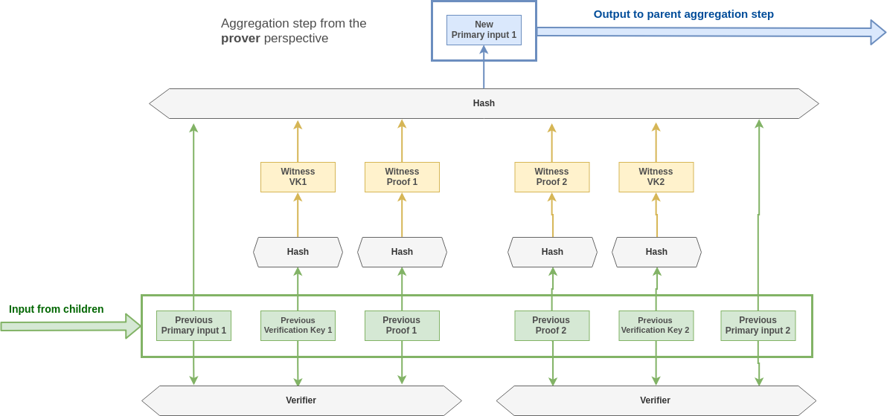

# Go-boojum

Boojum is an WIP protocol that aims at massively reducing the cost of zk verification on a blockchain through ZK-Snark proof aggregation.
A demo implementation of ZK-SNARK aggregation.

## Security

**The code in this repository is not suitable for production. It is PoC grade and has not undergone extensive testing. It additionally leaks memory.**

## Overview

This [article](https://eprint.iacr.org/2014/595.pdf) introduced recursive snark aggregation using cycle of elliptic curve, and created the concept of PCD and it has been seen as potential solution to instantly (30ms) verify the state of the chain through a single SNARK verification. This however raises the problem of data availability as it can potentially create situations where the state becomes inaccessible.

We propose here a predicate-agnostic solution to combine multiple ppzksnarks proofs (forged for various circuits). This is a variation of PCD and it comes with two circuits described in the diagram below:

Both circuits represents the following predicate: "I have a run a zk-snark verifier algorithm on 2 proofs, vk and primary inputs and their output was 1 in both". This will work for any circuits with a primary input of length 1 but this is however not a practical issue. Given a snark friendly CRH, we can always convert a multi-primary-input circuit into a single-primary-input by passing the primary inputs as auxilliary and adding the following constraint :

    Primary = Hash(Auxilliary)

This heuristic is furthermore applied to our circuits, thanks to that we enable proof for an instance of boojum circuit to be used as an input of another instance. Hence, we can recursively aggregate proof with the same two circuits.

The two circuits differs in the sense that they are not defined on the same EC. Any proof generated on one of theses can be verified recursively inside a proof on the other one. This is a necessary conditions for constructing a practical recursive SNARKs. We are using the elliptic curve cycle MNT4-MNT6 described [here](https://eprint.iacr.org/2014/595.pdf).

One of the main difference with PCD is that boojum accepts a verification key as a public parameter. The generator does not make assumption over the proof he is going to verify. The concern here is not about what circuit is being proved on but rather to convince the verifier run succesfully.

Additionnally, PCD recursive aggregation works in a sequential way: assignments are added one after the others in the proof while we describe a protocol aggregating proofs in a hierarchical fashion.

The leaf nodes (ie: the batch of proofs to be aggregated together) are inputed as:

* A verification key
* A proof
* The primary inputs of the circuits.

## On-chain verification

Each parent node (ie: aggregated proof) takes the hash of the previous proofs as primary inputs. Therefore during verification of the root proof, we need to first reconstruct its input by recursively hashing the intermediary nodes.

### Gas Cost estimation

Although no proper benchmark has been run yet. We can estimate that currently each aggregated proofs weights 355 bytes in average (373B for MNT6 and 337B for MNT4). And each verification key (on MNT4 only) weights 717B. This adds up to (355 + 337 + 717 = 1409B) for each proof. This represents an extra cost of 88641 Gas for each proof assuming we can neglect the zero-bytes.

This estimation also does not takes into account the cost of re-hashing the merkle tree. The current implementation makes use of subset-sum hash which is natively implemented in libsnark but which is broken today.

Some of the considered options are [WIP]:

* Pedersen Hash (We could re-use zcash implementation)
* MiMc
* David-Meyers

## Improving the size of the payload

In this aggregation protocol is that we don't care this much about the intermediary proofs. The only thing that matter is that *theses proofs exist and have been successfully verified* the same applies for the leafs proofs (ie: the proofs that are submitted to the process of aggregation).

In the end what an end-user wants to prove is only that they have a valid assignment for a given public input and a given circuit. Therefore, instead of publishing the proofs on-chain we could simply publish a hash of them. The proof would have to be communicated off-chain to the aggregator pool though.

Those improvement the circuit can be represented as below:

## Off-chain aggregation

Each aggregation steps takes about 20sec, that means it would takes over 5.5 hours to aggregate 1024 proofs. However, the tree structure makes it possible to distribute across a pool of worker. The problem now is how to organize those workers with an aggregation protocol.

Ideally the protocol should be reasonnably efficient (ie: replicate as least as possible the aggregation), resilient to malicious actors (no one can prevent or slow down the aggregation process efficiently).

Additionally this protocol have to include a reward mechanism in it in order to incentivize the worker to join the pool. This is not a trivial task because the BFT condition requires tasks to be replicated and that can create situations in which workers are actually not rewarded for their tasks.

Several design are possible:

* Centralized (not BFT)
* Centralized with leader election
* [handle](https://docs.google.com/presentation/d/1fL0mBF5At4ojW0HhbvBQ2yJHA3_q8q8kiioC6WvY9g4/edit#slide=id.p)

## Prerequisite

In order to build the source we need the following dependencies

* Docker

## Runing the demo

In this demo, a single worker go-routine aggregates a total of 8 proofs, the aggregation process is controlled by a scheduler go-routine who then verify the aggregated proof.

### With docker

    docker build . -t demo-boojum
    docker run demo-boojum

## Related work

This works makes use of

* [Succinct Non-Interactive Zero Knowledge for a von Neumann Architecture](https://eprint.iacr.org/2013/879.pdf)
* [Incrementally Verifiable Computation or Proofs of Knowledge Imply Time/Space Efficiency](https://link.springer.com/content/pdf/10.1007%2F978-3-540-78524-8_1.pdf)
* [Scalable Zero Knowledge via Cycles of Elliptic Curves](https://eprint.iacr.org/2014/595.pdf)
* [Aggregation protocol for large scale Byzantine committee](https://docs.google.com/presentation/d/1fL0mBF5At4ojW0HhbvBQ2yJHA3_q8q8kiioC6WvY9g4/edit#slide=id.p)